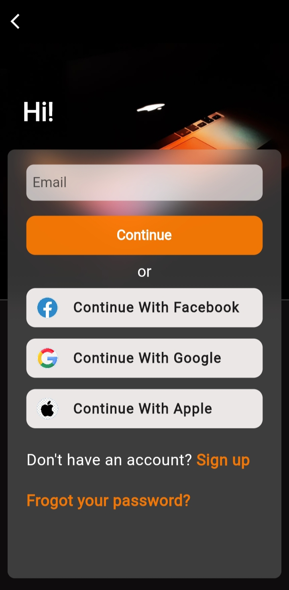
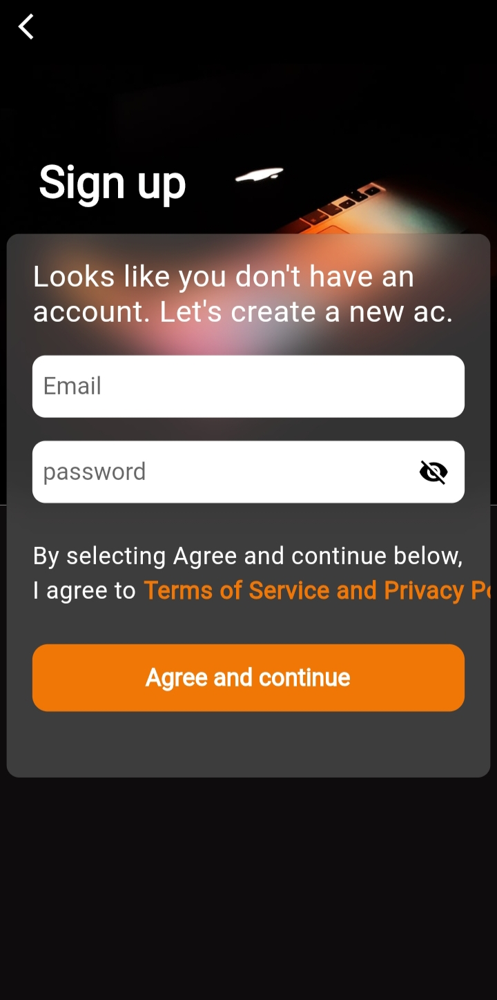
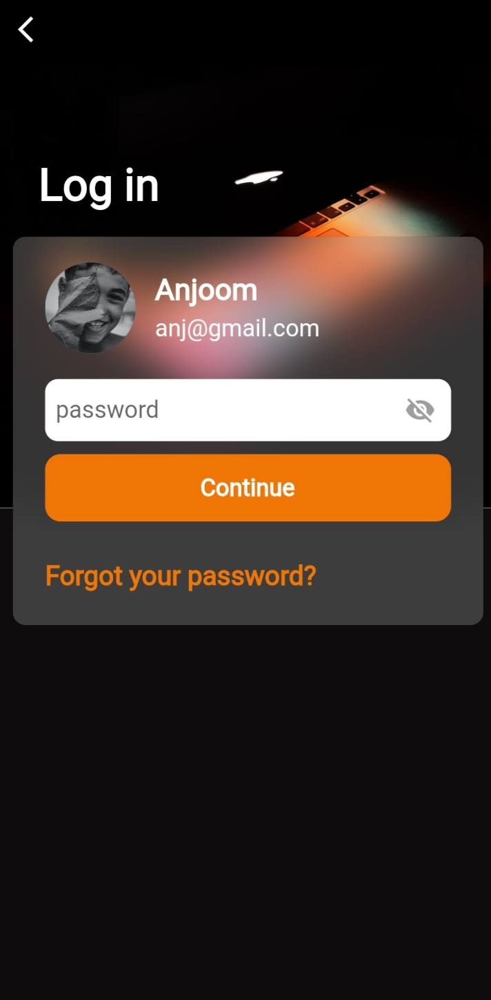

# login_app

I am happy to share with you my first login app useing firebase.

## ScreenShots

<table>
    <tr>
        <td></td>
        <td></td>
        <td></td>
    </tr>
</table>

## Screen recorder

https://user-images.githubusercontent.com/66232929/197094347-d41d5b3b-6fb8-4de9-9c24-d10b6cc00e0e.MP4

## Building

-Install Flutter
- `flutter pub get`
- `flutter run`
